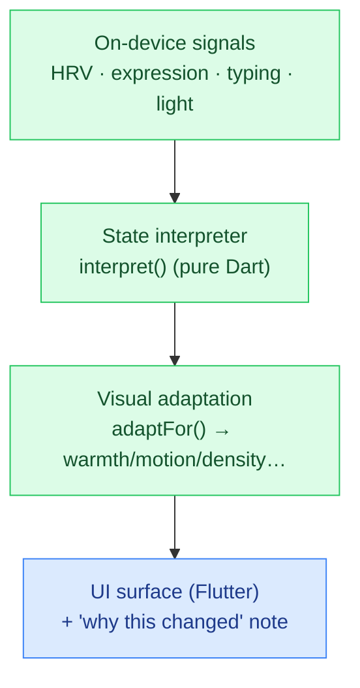

# AuraSurface

**▶ Live demo: https://parag-labs.github.io/aura-surface/** — a Flutter app running on the web
(also runs natively via `flutter run`). Everything is on-device; no backend, no API keys.

A **biometric & emotion-responsive visual language**. The interface's tone, colour temperature,
motion intensity, and information density adapt in real time to on-device signals — heart-rate
variability, a facial-expression estimate, typing rhythm, and ambient light — to gently match how
you feel. The changes are subtle and *always explained*, and every signal stays on the device.

Drag the signal sliders and watch the surface shift between **Calm**, **Focused**, **Stressed**,
**Tired**, and **Energized**, with a plain-language note about *why* it changed.

---

## Why

Emotion-aware interfaces are emerging, but refined, privacy-conscious, tasteful implementations
are rare — most are either creepy or gimmicky. AuraSurface aims for a "tasteful emotional skin":
noticeable but never distracting, and transparent about what it's doing.

## Core idea

The intelligence is a deterministic engine in `lib/core/aura_engine.dart`, with no Flutter
dependency:

- `interpret(signals)` → an `AffectState` (calm / focused / stressed / tired / energized). Total
  and deterministic across the whole signal space.
- `adaptFor(signals, state)` → a `VisualConfig` (warmth, motion, density, contrast, brightness,
  accent) **plus a `rationale` string** — the honest, user-facing explanation of the change.

Keeping this pure means the adaptation is unit-tested and reproducible, and the Flutter layer
simply animates toward whatever config the engine returns.

## Architecture



## Demo

```bash
flutter run -d chrome     # web
flutter run               # a device / simulator
```

## Design decisions

- **Subtle, not swings.** The adaptations are intentionally gentle (warmth, motion, density
  nudges), so the UI feels *helpful rather than creepy* — an acceptance goal of the spec.
- **Always explain the change.** Every state carries a `rationale` shown in the UI, and there is a
  standing note that signals never leave the device. Transparency is part of the product.
- **Privacy by design.** The engine takes already-normalized signals; in a real build the raw
  sensor processing (HRV, MediaPipe expression, typing cadence, light) happens on-device and only
  the derived 0..1 signals feed the engine.

## Testing

`flutter test` — 10 tests: state interpretation for each affect, totality/determinism across the
signal space, that stress calms the UI (less motion/density) while energy livens it (more
motion/contrast), field ranges + rationale presence, and ambient-light → brightness.

```bash
flutter test
```

## Roadmap

- Real signal sources: `sensors_plus` light, an HRV estimate, MediaPipe expression, typing cadence.
- User controls to tune sensitivity or opt specific signals in/out.
- A wellness/focus context that uses the adaptation for real interventions.

## Layout

```
aura-surface/
├── lib/
│   ├── core/aura_engine.dart   # pure Dart: signals → affect state → visual config (unit-tested)
│   └── main.dart               # the adaptive surface + signal controls + rationale
├── test/                       # 10 flutter_test unit tests
└── web/
```

## License

MIT — see [LICENSE](LICENSE).
